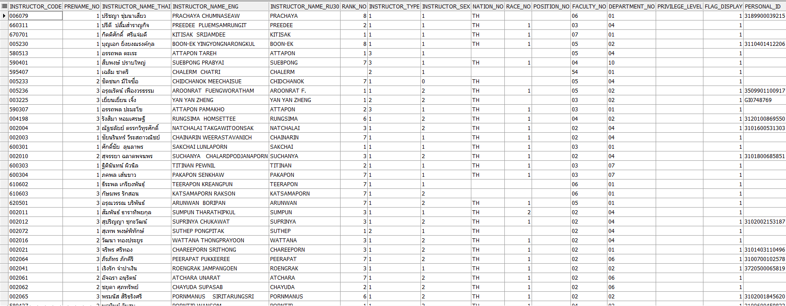

CREATE TABLE NORAPAT.UGB_INSTRUCTOR
(
  INSTRUCTOR_CODE       CHAR(6 BYTE)            NOT NULL,
  PRENAME_NO            NUMBER(3),
  INSTRUCTOR_NAME_THAI  VARCHAR2(150 BYTE),
  INSTRUCTOR_NAME_ENG   VARCHAR2(100 BYTE),
  INSTRUCTOR_NAME_RU30  VARCHAR2(100 BYTE),
  RANK_NO               NUMBER(2),
  INSTRUCTOR_TYPE       CHAR(1 BYTE),
  INSTRUCTOR_SEX        CHAR(1 BYTE),
  NATION_NO             VARCHAR2(2 BYTE),
  RACE_NO               NUMBER(1),
  POSITION_NO           NUMBER(2),
  FACULTY_NO            CHAR(2 BYTE),
  DEPARTMENT_NO         CHAR(2 BYTE),
  PRIVILEGE_LEVEL       CHAR(1 BYTE),
  FLAG_DISPLAY          NUMBER(1),
  PERSONAL_ID           VARCHAR2(20 BYTE)
)
TABLESPACE SYSTEM
PCTUSED    40
PCTFREE    10
INITRANS   1
MAXTRANS   255
STORAGE    (
            INITIAL          64K
            NEXT             1M
            MINEXTENTS       1
            MAXEXTENTS       UNLIMITED
            PCTINCREASE      0
            FREELISTS        1
            FREELIST GROUPS  1
            BUFFER_POOL      DEFAULT
           )
LOGGING 
NOCOMPRESS 
NOCACHE;

COMMENT ON COLUMN NORAPAT.UGB_INSTRUCTOR.INSTRUCTOR_TYPE IS 'ประเภทอาจารย์ 
1 = อาจารย์ประจำ  
2 = อาจารย์พิเศษ  
3 = ผู้บริหาร';

COMMENT ON COLUMN NORAPAT.UGB_INSTRUCTOR.FLAG_DISPLAY IS 'ใช้บอกว่ารหัสอาจารย์นี้ยังใช้อยู่ในปัจจุบันหรือไม่  
0 = ไม่ได้ใช้งาน 
1 = ใช้งานอยู่';

COMMENT ON COLUMN NORAPAT.UGB_INSTRUCTOR.PERSONAL_ID IS 'หมายเลขบัตรประชาชน/ Passport';

