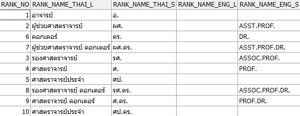

DROP TABLE NORAPAT.UGB_RANK CASCADE CONSTRAINTS;

CREATE TABLE NORAPAT.UGB_RANK
(
  RANK_NO           NUMBER(2)                   NOT NULL,
  RANK_NAME_THAI_L  VARCHAR2(80 BYTE),
  RANK_NAME_THAI_S  VARCHAR2(20 BYTE),
  RANK_NAME_ENG_L   VARCHAR2(80 BYTE),
  RANK_NAME_ENG_S   VARCHAR2(40 BYTE)
)
TABLESPACE SYSTEM
PCTUSED    40
PCTFREE    10
INITRANS   1
MAXTRANS   255
STORAGE    (
            INITIAL          64K
            NEXT             1M
            MINEXTENTS       1
            MAXEXTENTS       UNLIMITED
            PCTINCREASE      0
            FREELISTS        1
            FREELIST GROUPS  1
            BUFFER_POOL      DEFAULT
           )
LOGGING 
NOCOMPRESS 
NOCACHE;

